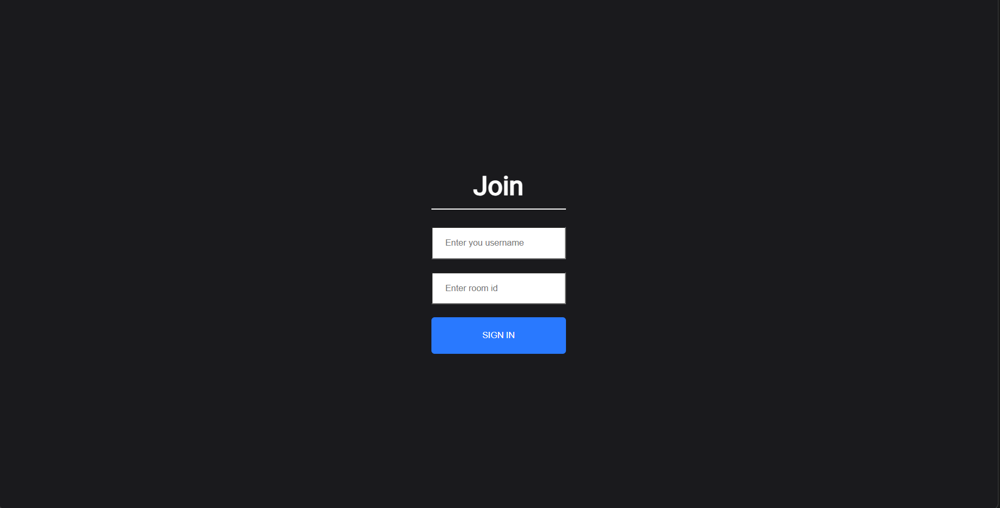
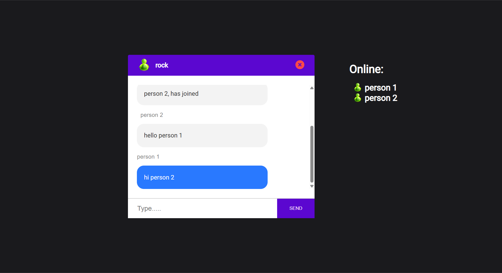
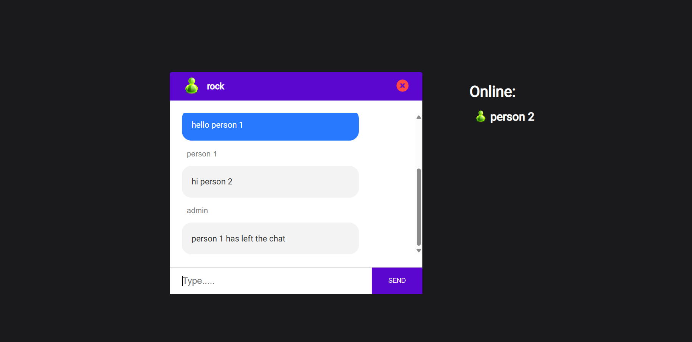
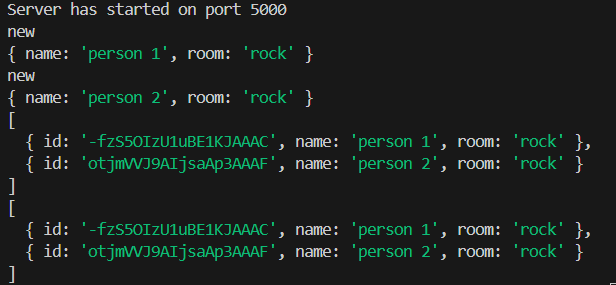

# ChatApp

A real-time chat application built with React on the frontend and Express on the backend using Socket.IO for websocket communication. The app allows users to join chat rooms by entering a username and room ID, enabling group conversations within the same room.

## Demo





## Features

- User login with username and room ID.
- Real-time messaging between users in the same room.
- Uses Socket.IO to establish and manage websocket connections.
- Room-based communication: users can join specific rooms via room ID.
- Simple and intuitive React frontend UI.
- Express backend handling Socket.IO connections and message broadcasting.

## Getting Started

### Prerequisites

- Node.js (v14+ recommended)
- npm or yarn

### Installation

1. Clone the repository:
```
git clone https://github.com/your-username/chatapp.git
cd chatapp
```

2. Install backend dependencies:
```
cd server
npm install
```

3. Install frontend dependencies:
```
cd ../client
npm install
```

### Running the App

1. Start the backend server:
```
cd server
npm start
```

By default, the backend listens on port 5000.

2. Start the frontend development server:
```
cd ../client
npm start
```

This starts the React app on port 3000 (default). The frontend communicates with the backend Socket.IO server.

3. Open your browser and navigate to:
```
http://localhost:3000
```

## Usage

- On the login form, enter a **username** and a **room ID**.
- Click **Join**.
- You will be connected to the Socket.IO server and entered into the specified room.
- Any user joining the same room ID will be able to exchange messages with you in real-time.

## Project Structure
```
/server
|-- index.js (Express + Socket.IO server)
/client
|-- src
  |-- components
    |-- Chat
    |-- InfoBar
    |-- Input
    |-- Join
    |-- Messages
    |-- TextContainer
  |-- App.js
```

## Technologies Used

- React
- Express
- Socket.IO (client and server)
- JavaScript (ES6+)


